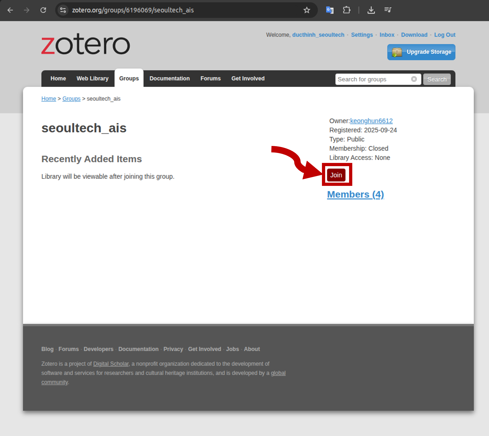
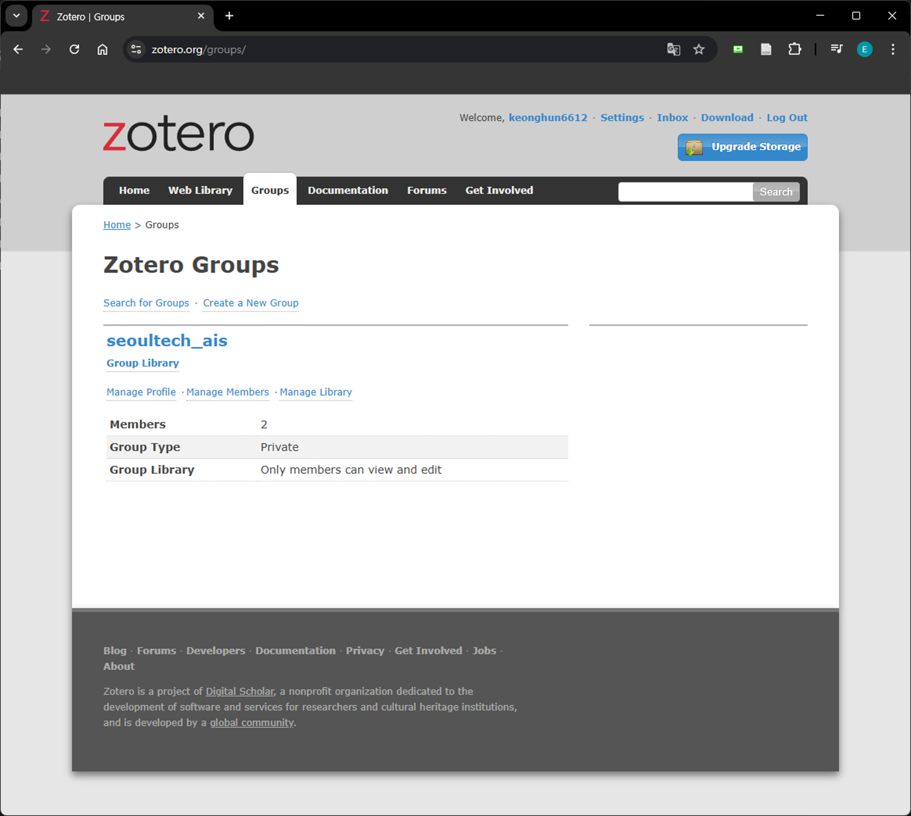
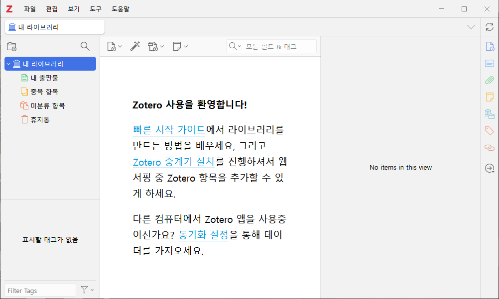
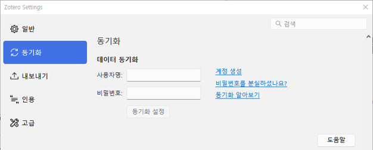
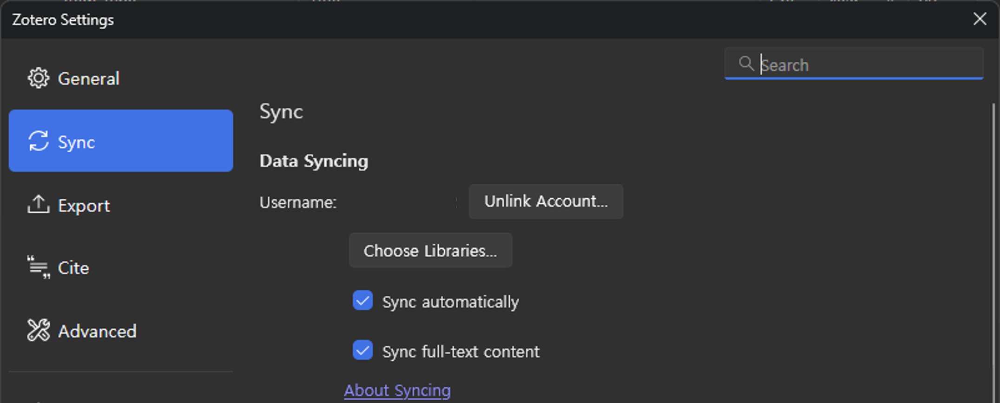

# Zotero 소개 및 활용

`Zotero 공식 홈페이지`: [https://www.zotero.org/](https://www.zotero.org/)

연구 자료의 수집, 정리, 인용부터 협업까지 지원하는 올인원 서지 관리 도구.

- Zotero Application (데스크탑 앱)
  - 역할: 서지 정보의 저장소이자 관리 본체(Main Hub).
  - 기능: 수집된 자료의 분류/태그 정리, PDF 열람 및 주석, Word/LaTeX 플러그인 연동 등 실질적인 관리 작업 수행.

- Zotero Connector (Chrome/Edge 확장 프로그램)
  - 역할: 웹 브라우저와 데스크탑 앱을 연결하는 수집 도구(Collector).
  - 기능: 웹 서핑 중 논문이나 책을 감지하면 주소창 옆 아이콘이 변하며, 클릭 시 서지 정보와 원문(PDF)을 데스크탑 앱으로 즉시 전송.

## 1. 계정 생성 및 그룹 신청

`계정 생성 주소`: [https://www.zotero.org/user/register](https://www.zotero.org/user/register)

계정 생성 후 아래 가입 주소에서 연구실 그룹 신청

`연구실 Zotero 그룹`: [https://www.zotero.org/groups/6196069/seoultech_ais](https://www.zotero.org/groups/6196069/seoultech_ais)

`!!! 반드시 신청 후 그룹 관리자에게 가입 신청 여부를 알려줄 것!!!`

아래 그림과 같이 그룹이 출력되면 정상적으로 처리가 완료 된 것.

## 2. 설치

`다운로드 경로`: [https://www.zotero.org/download/](https://www.zotero.org/download/)

설치 순서는 `데스크탑 앱`과 `브라우저 커넥터` 순으로 설치를 추천함.

Zotero는 데스크탑 앱과 브라우저 커넥터가 한 쌍으로 작동하므로, `반드시 둘 다 설치해야 함`.

### 데스크탑 앱

데스크탑 설치 프로그램 다운로드 후 기본 값으로 설치 진행.

설치 후 실행 시 다음과 같은 화면이 출력 됨.

### 브라우저 커넥터

브라우저 커넥터 설치 후 아래 그림과 같이 작업 도구 고정 필요.

## 3.초기 작업

### 데스크탑 앱 동기화 작업

앱 화면 우측 상단에 있는 새로고침 아이콘 또는 설정의 동기화 [Sync] 탭

`설정 탭 위치 : 편집 [Edit] -> 설정 [Setting]`

해당 설정에서 생성한 아이디와 비밀번호 입력후 `동기화 설정` 클릭

아래 그림과 같이 그룹이 출력되면 정상적으로 처리가 완료 된 것.

### 데스크탑 앱 기본 설정

2가지 변경 사항이 필요.

설정 탭 위치 : 편집 [Edit] -> 설정 [Setting]

1. 언어 설정 변경 일반[General] 항목

## 2. 핵심 기능

- `웹 수집`: Connector를 통해 논문, 신문 기사, 특허 등 다양한 소스를 원클릭 저장.
- `클라우드 동기화`: PC, 태블릿, 웹 라이브러리 간 실시간 동기화로 작업 연속성 보장.
- `문서 연동`: MS Word, Google Docs, LaTeX 등 작성 도구에 인용 플러그인 제공.

## 3. 연구 성과 관리 및 협업
- `내 저작물 (My Publications)`: 자신의 연구 성과를 별도 컬렉션으로 관리하고 프로필을 통해 공개하여 인용 유도.
- `그룹 라이브러리 (Group Libraries)`: 팀원과 자료 및 메모를 실시간으로 공유하여 공동 연구 효율 극대화.

## 4. 추천 확장 모듈
- `[Better BibTeX (BBT)](https://github.com/retorquere/zotero-better-bibtex)`: LaTeX 사용자를 위한 필수 도구. 충돌 없는 고유 인용 키 생성 및 `.bib` 파일 자동 업데이트.
- `[Mdnotes](https://github.com/argenos/zotero-mdnotes)`: 서지 정보와 메모를 Markdown으로 내보내어 개인 지식 베이스 구축.
