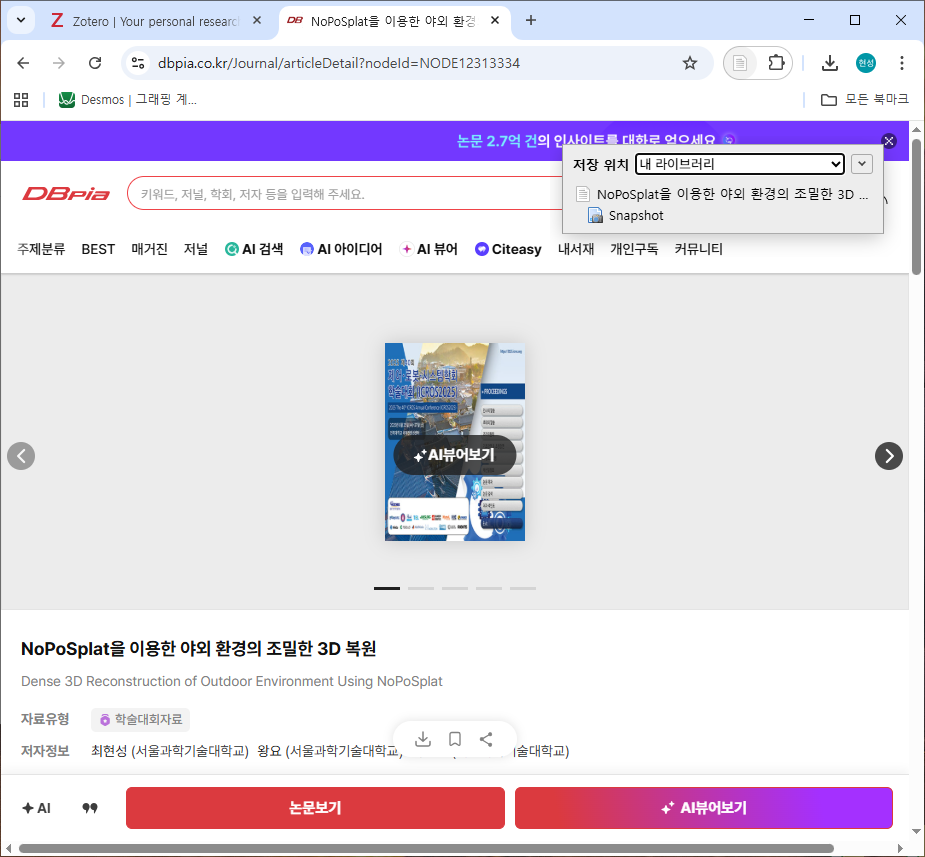

# Zotero 실전 가이드: 관리 및 수집

## 1. 컬렉션 관리

폴더 트리 구조와 유사, 유연한 생성 및 계층화 지원.

* 생성:
  * `새 컬렉션` 아이콘 클릭 또는 라이브러리 우클릭.
  * 주제, 프로젝트, 연도별 명명 권장.
* 계층화 (Sub-collection):
  * 상위 컬렉션 우클릭 -> `새 하위 컬렉션`.
  * 드래그 앤 드롭으로 상/하위 구조 변경 가능.
* 삭제 옵션:
  * `컬렉션 삭제`: 분류 폴더만 삭제 (내용물 보존).
  * `컬렉션 및 아이템 삭제`: 내용물까지 휴지통 이동 (주의 요망).

## 2. 아이템 추가 (자료 수집)

다양한 경로를 통한 신속하고 정확한 서지 정보 입력.

### 2.1 웹 커넥터 (Web Connector)

브라우저 확장을 통한 원클릭 수집 (가장 강력함).

* 사용법:
    1. 논문/자료 페이지 접속 (Google Scholar, arXiv 등).
    2. 주소창 옆 Zotero 아이콘 클릭.
    3. 현재 선택된 컬렉션으로 PDF 포함 자동 저장.
* 아이콘 변화:
  * 논문📄, 책📘, 웹페이지🌐 등 자료 유형 자동 인식.

### 2.2 식별자 추가 (ISBN/DOI)

* 마술봉 아이콘: 상단 도구 모음 위치.
* 기능: ISBN, DOI, PMID 입력 시 메타데이터 자동 완성.
* 장점: 수기 입력 대비 오타 없음, 가장 정확함.

## 3. 아이템 관리 (분류 및 정리)

참조(Reference) 기반의 유연한 분류 시스템.

* 분류 (할당):
  * 아이템을 원하는 컬렉션으로 드래그 앤 드롭.
  * 원리: 복사가 아닌 참조 추가. (하나의 논문이 여러 컬렉션에 존재).
* 제거 (Remove):
  * `Delete` 키: 해당 컬렉션에서만 제외 (라이브러리 원본 유지).
  * 완전 삭제는 '내 라이브러리' 또는 우클릭 메뉴 활용.
* 부가 정보 관리:
  * 태그: 하단 태그 탭 활용, 색상 지정(1~9번 단축키) 가능.
  * 노트: 아이템 하위 노트 생성, 인용문 및 요약 정리.