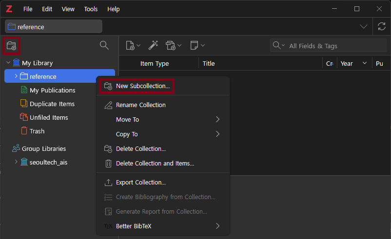
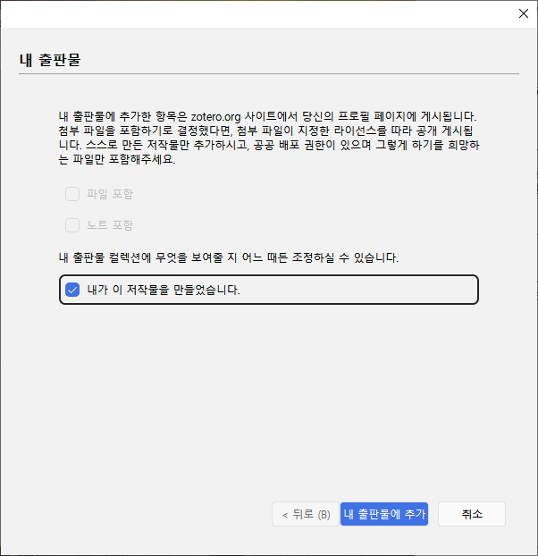
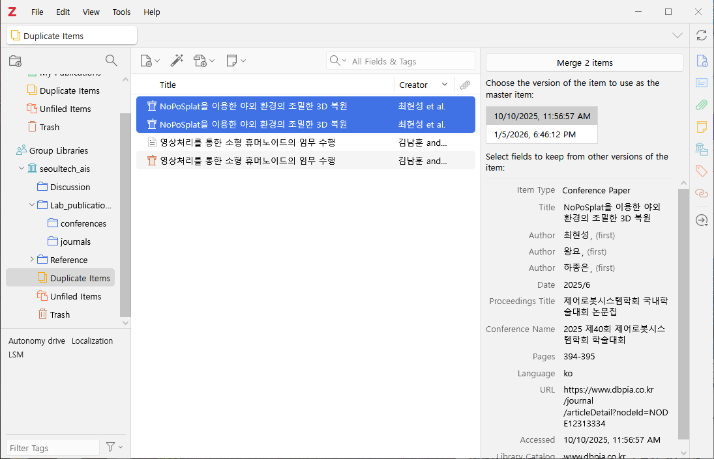

# Zotero 실전 가이드: 컬렉션 생성 및 관리

## 1. 컬렉션 생성과 관리

* 컬렉션 (Collection): 아이템을 분류하는 그룹. (파일 시스템의 `폴더`에 해당)

* 폴더 트리 구조와 유사, 유연한 생성 및 계층화 지원.

* 생성:  
  

  * `새 컬렉션` 아이콘 클릭 또는 라이브러리 우클릭.

  * 컬렉션의 이름은 주제, 프로젝트, 연도별 명명 권장.  
    ex) 2025년도 3차원 재구성 관련 연구 -> 2025_3d_Reconstruction

* 계층화 (Sub-collection):

  * 각각의 컬렉션은 다른 컬렉션을 하위 계층으로 포함 할 수 있음.

    ``` text
    My Library
    ├── ref
    │   ├── 2025
    │   │   ├── 3d_Reconstruction
    │   │   └── obj_detection
    │   ├── 2024
    │   │   ├── sementic_segmentation
    │   │   └── base_one_llm
    │   └── ...
    ├── My Publication
    ├── ...
    └── ...
    ```

  * 드래그 앤 드롭으로 상/하위 구조 변경 가능.

* 삭제 옵션:

  * 각각의 아이템은 컬렉션에 종속된 구조가 아님. -> 자세한 내용은 [해당 문서](./02_collection_structure.md) 참고
  
  * `컬렉션 삭제 [Delete Collection]`: 분류 폴더만 삭제 (내용물 보존).

  * `컬렉션 및 아이템 삭제 [Delete Collection and Items]`: 내용물까지 휴지통 이동 (주의 요망).

## 2. 특수 컬렉션 (Special Collections)

Zotero가 자동으로 제공하거나 특수한 목적을 가진 관리 항목.

### 2.1 내 출판물 (My Publications)

사용자가 직접 저술한 논문을 관리하고 공유하는 공간.

* 기능: Zotero.org 프로필을 통해 전 세계에 내 연구 성과 공개 가능.

* 주의사항: 저작권 문제가 없는 파일만 포함해야 함.

* 파일 추가: 드래그 앤 드롭으로 추가 시, 아래와 같은 경고 메시지 출력 (공개 여부 확인).



### 2.2 중복된 항목 (Duplicate Items)

DB 내에서 서지 정보(제목, 저자 등)가 유사한 항목을 자동 검출.

* 병합 (Merge)

  * 중복된 항목 선택 시 우측 패널에 병합 화면 출력.

  * 상이한 정보가 있을 경우 대표 정보를 선택하여 하나의 완벽한 아이템으로 병합 가능.



### 2.3 분류되지 않은 항목 (Unfiled Items)

어떤 컬렉션(폴더)에도 속하지 않은 '고아(Orphan) 아이템' 모음.

* 의미: 아이템이 컬렉션과 분리된 독립 객체임을 증명하는 공간.

* 활용:

  * 웹에서 급하게 수집하여 '내 라이브러리'에만 쌓인 자료 확인 용도.
  * 주기적으로 확인하여 적절한 컬렉션으로 분류(드래그) 후, 목록이 비어있는지 확인하는 습관 권장.

