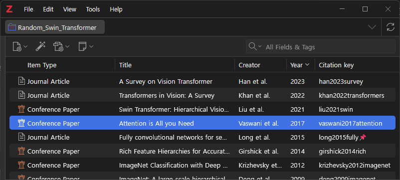
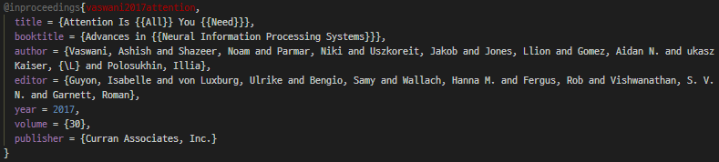
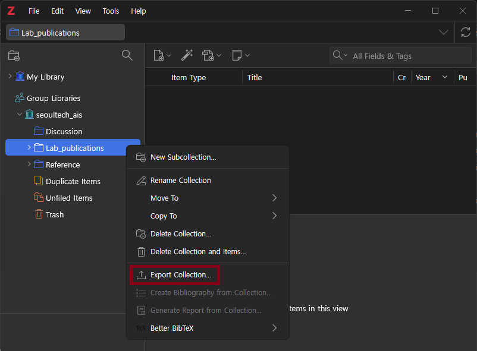
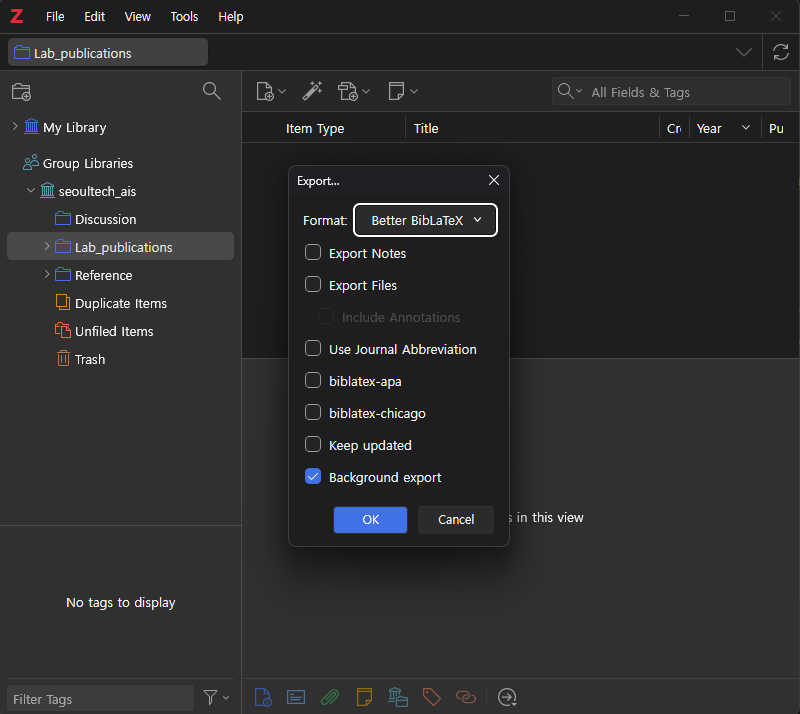

# Zotero 실전 가이드: BibTeX 생성 및 활용

## 1. BibTeX (.bib) 이해

* 개요: LaTeX 문서 작성 환경에서 표준으로 사용하는 서지 정보 파일 형식.
* 목적: 논문 작성 시 본문 내 인용(Citation)과 참고 문헌(Bibliography) 목록의 자동 생성 및 서식 관리.
* 특징:
  * 서지 정보를 바탕으로 텍스트 기반의 구조화된 데이터.

    

    

  * LaTeX 엔진이 `.bib` 파일을 참조하여 문서 스타일에 맞게 문헌 정보 자동 배치.

## 2. 컬렉션을 BibTeX로 내보내기

1. 내보낼 컬렉션(Collection) 마우스 우클릭
    

2. Popup 메뉴에서 `Export Collection...` 선택.

3. 팝업 창 Format 설정에서 `BibTeX` (또는 `BibLaTeX`) 선택  

    -> 이후 [Better BibTeX (BBT) 설치](./extention/zotero_development_guide.md) 시 `Better BibTeX` (또는 `Better BibLaTeX`) 선택

    

    주요 옵션 설명

    * Keep updated: 체크 시, Zotero 라이브러리 변경 사항이 해당 `.bib` 파일에 지속적으로 반영됨 (단방향 동기화).

4. `OK` 버튼 클릭 후 파일 저장 경로 지정.
