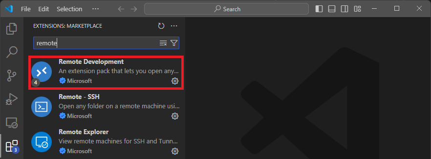

# 확장 프로그램(Extension) 설치 및 관리

## 개요

- VS Code의 기능을 확장하는 핵심 플러그인 시스템.
- 언어 지원(Python, C++ 등), 도구(GitLens, Docker), 테마 등 다양한 기능 추가.

## 사용 방법

1. 마켓플레이스 접속
   - 좌측 사이드바의 'Extensions' 아이콘 클릭 (블록 쌓기 모양).
   - 단축키: `Ctrl + Shift + X`.

2. 검색 및 설치
   - 상단 검색창에 키워드 입력 (예: `Python`, `remote`, `Prettier`, `git`).
   - 원하는 항목의 'Install' 파란색 버튼 클릭.
   - 설치 완료 후 기능 즉시 적용 또는 'Reload Required' 버튼 클릭.

## 관리 (비활성화 및 삭제)

- 목록 확인: 검색창의 필터 아이콘(`@installed`) 이용해 설치된 항목 확인 가능.
- 관리 메뉴:
  - 확장 프로그램 항목 우측 하단 톱니바퀴(Manage) 아이콘 클릭.
  - 'Disable'(비활성화) 또는 'Uninstall'(삭제) 선택.
