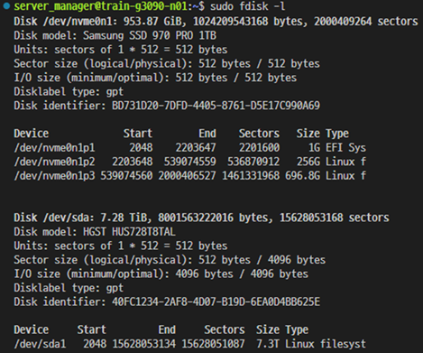
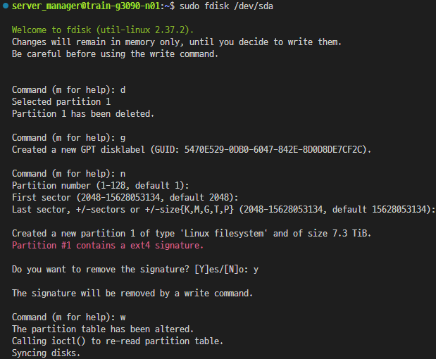

# 저장 장치 파티션 구성과 파일 시스템 할당

이 매뉴얼은 우분투에서 저장 장치에 파티션을 구성하고 환경 및 작업에 맞는 파일 시스템을 할당하는 전체 과정을 단계별로 설명함.

## 목차

1. [용어 설명](#용어-설명)

2. [과정 및 명령어 사용](#과정-및-명령어-사용)

   - [저장 장치 인식 여부 및 정보 확인](#저장-장치-인식-여부-및-정보-확인)

   - [저장 장치 파티션 구성](#저장-장치-파티션-구성)

   - [파일 시스템 할당](#파일-시스템-할당)

## 용어 설명

일반적으로 컴퓨터에서 사용되는 데이터를 장기적으로 보관하기 위해서, 물리적으로 데이터를 저장 할 수 있는 장치( = `저장 장치`)를 사용함.  
저장 장치에 데이터를 저장 할 수 있도록 장치 내부의 주소의 범위를 구분하여 나누는 것을 `파티션 (partition)` 작업이라 한다.  
이렇게 구성된 파티션에 존재하는 데이터를 입출력하는 담당하는 시스템을 `파일 시스템 (file system)`이라고 한다.

## 과정 및 명령어 사용

### 저장 장치 인식 여부 및 정보 확인

파티션 작업의 경우 작업의 대상이 되는 저장 장치를 선택하여 진행함.

이를 위하여 현재 단말기에 인식된 저장 장치의 정보를 출력하는 명령어를 사용하여 작업 하고자 하는 저장 장치의 이름을 확인.

```bash
sudo fdisk -l
```



해당 명령어를 통해 출력된 정보에서 저장 장치의 이름은 다음 규칙을 바탕으로 작성되어 있음.  
해당 규칙을 고려하여, 작업하고자 하는 장치의 구분명을 확인하고 다음 작업을 진행 하면 됨.

<center>

| 저장 장치 연결 방식 | 저장 장치 구분 | 저장 장치 이름 규칙                           |
| :-----------------: | :------------: | :-------------------------------------------: |
| SATA                | HDD            | /dev/hd{a~z} -> /dev/hda, /dev/hdb, /dev/hdc  |
|                     | SSD            | /dev/sd{a~z} -> /dev/sda, /dev/sdb, /dev/sdc  |
| NVMe                | SSD            | /dev/nvme{0~}n1 -> /dev/nvme0n1, /dev/nvme1n1 |

<figcaption>저장 장치 구분명 작성 규칙</figcaption>
</center>

### 저장 장치 파티션 구성

작업하고자 하는 저장 장치를 대상으로 아래 명령어를 사용하여 시작하여, 파티션 작업을 추가 명령어를 통해 진행함.

```bash
sudo fdisk ${저장_장치_구분명}
```



<center>

| 명령어 | 역할                                                                                          |
| :----: | :-------------------------------------------------------------------------------------------- |
| m      | 기초적인 명령어 정보를 출력                                                                   |
| n      | 새로운 파티션을 추가. 파티션이 없을 경우 1, 마지막 파티션 번호 보다 1 큰값을 기본값으로 사용. |
| d      | 지정된 번호의 파티션을 제거. 단일 파티션만 존재 할 경우 해당 파티션을 자동 삭제.              |
| g      | 현재 테이블을 gpt 파티션 테이블로 변경. (2.2Tb 이상의 용량을 단일 파티션으로 구성 할 때 사용) |
| w      | 현재까지 작성된 파티션 변경 사항을 저장                                                       |

<figcaption>파티션 작업 명령어</figcaption>
</center>

### 파일 시스템 할당

생성된 파티션에 데이터를 읽고 쓰기 위한 파일 시스템을 할당 하기 위하여, 다음 명령어를 사용함.  
작업하는 환경에 따라 효율적인 데이터 입출력을 위한 적절한 파일 시스템을 할당 할 수 있음.

```bash
sudo mkfs.${파일_시스템_이름} ${파티션_이름}
```

<center>

| 파일 시스팀 이름 | 특징징                                           |
| :--------------: | :----------------------------------------------- |
| ext4             | 일반적으로 Ubuntu에서 자주 사용되는 파일 시스템. |
| ntfs             | Ubuntu와 window에서서 공유 가능한 파일 시스템.   |

<figcaption>주요 파일 시스팀</figcaption>
</center>
