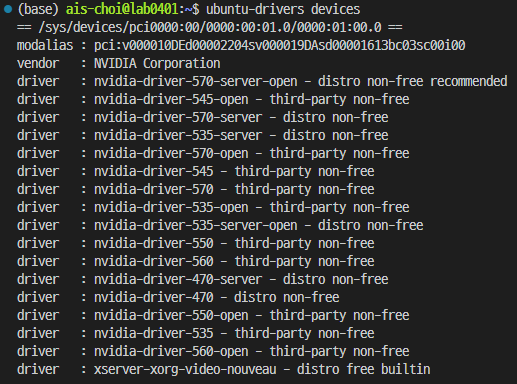
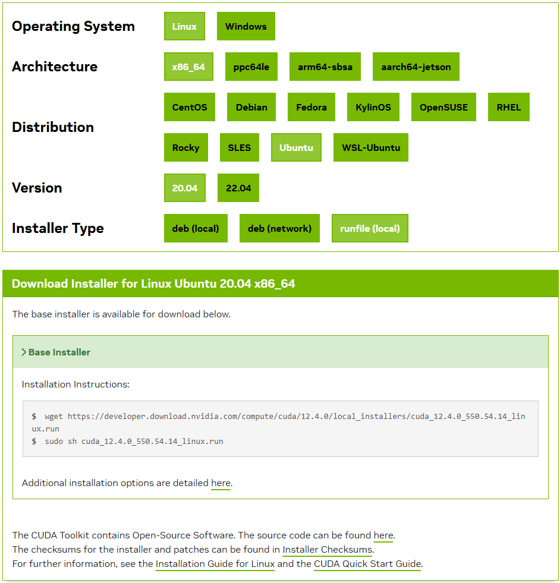

# nvidia GPU 드라이버 설치 및 CUDA와 cuDNN 설치

이 메뉴얼은 우분투에서 GPU 사용하기 위하여 필요한 드라이버 및 CUDA toolkit과 cuDNN 확장 설치 과정을 정리함. 

## 목차

## CUDA 설치 및 설정

### nvidia 드라이버 설치

CUDA toolkit을 설치하기 이전에 GPU를 우분투 시스템에서 제어 할 수 있도록 하는 명령어 묶음을 설치해야 함.

기본적으로 우분투에서 자체적으로 각 버전마다 적합한 nvidia 드라이버를 제공하고 있음.

이때 드라이버의 작명 규칙은 `nvidia-driver-{버전 이름}-{server = headless, open = 오픈소스 여부}`와 같음

해당 옵션 중 오픈소스 여부에 대한 상세한 내용은 다음 [내용](https://developer.nvidia.com/blog/nvidia-transitions-fully-towards-open-source-gpu-kernel-modules/)을 참고

```bash
sudo add-apt-repository ppa:graphics-drivers/ppa  # nvidia driver 저장소 추가.

sudo apt update # 저장소 목록 업데이트

ubuntu-drivers devices  # 설치 가능한 드라이버 목록 확인
```



nvidia gpu 드라이버를 설치하고자 하는 환경을 고려해서 적절한 옵션을 선택하여 설치 하면 됨.

사용하고자 하는 CUDA 버전을 고려하여 적절한 드라이버를 설치해야 할 필요가 있음.

`기본적으로 각 환경에서 제시된 드라이버 중 recommended로 제시된 드라이버를 설치하는 것을 추천 함.`

```bash
sudo apt-get install {설치하고자_하는_nvidia_gpu_드라이버_이름}
```

<center>

| CUDA 버전 | nvidia 드라이버 지원 최소 버전 |
| :-------: | :-----------------------: |
| 12.4      |  |
| 12.1      | >=525.60.13 |
| 11.8      |  |
| 11.7      |  |
| 11.6      |  |
| 11.1      | >= 450.80.02 |

<figcaption>CUDA 버전 별 지원 버전 정보 </figcaption>
</center>

### CUDA toolkit 설치

[공식 사이트](https://developer.nvidia.com/cuda-downloads)에서 사용하고자 하는 버전의 CUDA toolkit 다운로드 가능.

CUDA를 사용하고자 하는 환경을 고려해서, 적절한 옵션을 선택하여 설치를 위한 파일을 다운 받고 안내 받은 설치 과정을 따르면 됨.

본 메뉴얼에서는 별도의 인터넷 연결이 필요 없으며, 비교적 단순한 과정으로 처리되는 `runfile(local)` 방식으로 진행 함



자주 사용되는 script 파일은 연구실 데이터 서버에 저장 되어 있음. -> `//Dataserver/public/300. utility/nvidia` 참고

```bash
sudo chmod +775 {CUDA_설치_파일명}  # 다운로드 또는 데이터 서버에서 복사한 설치 파일의 권한 부여

sudo bash {CUDA_설치_파일명}  # 설치 파일 실행
```
